# Trading Platform Architecture

## System Overview

**Shunryū STP** (Straight-Through-Processing) Trading Platform is a full-stack, real-time trading simulation and analytics system. The architecture is organized into five primary layers:

1. **Frontend Presentation Layer** — React SPA with role-based UIs (Trader/Admin)
2. **API Gateway & Authentication Layer** — FastAPI with JWT, CORS, WebSocket gateway
3. **Business Logic Services** — Portfolio, Analytics, Order Processing, Backtesting, Decision Intelligence
4. **Data Feed & Real-Time Layer** — Market Clock simulator, WebSocket broadcaster, Live price feeds
5. **Data & Caching Layer** — SQLite (persistent), In-memory market data, historical OHLCV

---

## Architecture Diagram (Mermaid)

```mermaid
graph TD
    subgraph Client["🎨 Frontend Presentation Layer"]
        Landing["Landing Page<br/>Unauthenticated"]
        Auth["Auth Module<br/>Login/Register"]
        Trader["Trader Dashboard<br/>- Overview<br/>- Trade<br/>- Portfolio<br/>- Orders<br/>- Journal<br/>- Analytics<br/>- Backtesting<br/>- AI Assistant"]
        Admin["Admin Dashboard<br/>- KYC Queue<br/>- Accounts<br/>- Compliance<br/>- Feed Control<br/>- Audit Logs"]
        UI["🎯 UI Components<br/>- Charts Recharts/KlineChart<br/>- Forms & Modals<br/>- Real-time Ticker<br/>- News Feed<br/>- Level Alerts"]
    end

    subgraph Auth_Layer["🔐 Auth & CORS Layer"]
        APIGateway["FastAPI Gateway<br/>CORS Middleware<br/>JWT Token Validation"]
        AuthSvc["Auth Service<br/>- JWT signing/validation<br/>- Role-based access<br/>- Password hashing"]
    end

    subgraph API["📡 API Routes & Routers"]
        Orders["Orders API<br/>POST /orders<br/>GET /orders<br/>PUT /orders/:id"]
        Portfolio["Portfolio API<br/>GET /portfolio/metrics<br/>GET /portfolio/positions"]
        Analytics["Analytics API<br/>GET /analytics/performance<br/>POST /analytics/indicators"]
        Reports["Reports API<br/>GET /reports/:id<br/>POST /reports/generate"]
        Prices["Prices API<br/>GET /prices/:ticker<br/>GET /prices/history"]
        PaperTrade["Paper Trading API<br/>POST /paper-trading/trade<br/>GET /paper-trading/metrics"]
        News["News API<br/>GET /news<br/>POST /news/alerts"]
        Backtest["Backtest API<br/>POST /backtest/run<br/>GET /backtest/results<br/>GET /backtest/strategies"]
        GenAI["GenAI/Decision API<br/>POST /genai/analyze<br/>GET /decision/signals<br/>POST /journal/entry"]
        WebSocketAPI["WebSocket Gateway<br/>ws://market/:ticker<br/>ws://portfolio/:account"]
    end

    subgraph Services["⚙️ Business Logic Services"]
        OrderEng["Order Engine<br/>- Validation<br/>- Routing<br/>- Execution<br/>- State tracking"]
        PortfolioEng["Portfolio Engine<br/>- Position tracking<br/>- PnL calculation<br/>- Cash management<br/>- Risk metrics"]
        AnalyticsEng["Analytics Engine<br/>- Performance metrics<br/>- Drawdown calc<br/>- Indicator system<br/>- Signal generation"]
        BacktestEng["Backtest Executor<br/>VectorBT Integration<br/>- Strategy simulation<br/>- Equity curve calc<br/>- Trade log extract<br/>- Sharpe/Drawdown"]
        BacktestRegistr["Strategy Registry<br/>- Preset strategies<br/>- Parameter validation<br/>- Signal generation"]
        DecisionEng["Decision Engine<br/>- AI-driven signals<br/>- Sentiment analysis<br/>- Confidence scoring"]
        JournalEng["Journal Engine<br/>- Trade notes<br/>- Lessons learned<br/>- News correlation"]
        LevelMonitor["Level Monitor<br/>- Price level alerts<br/>- Breakout detection"]
        KYCEng["KYC Engine<br/>- Doc validation<br/>- Risk scoring<br/>- Compliance checks"]
        MarketClock["Market Clock<br/>- Simulated time<br/>- Trading hours<br/>- Session mgmt"]
    end

    subgraph Feed["📊 Real-Time Feed & Broadcaster"]
        FeedSim["Feed Simulator<br/>- Historical data replay<br/>- Minute-level ticks<br/>- Timezone handling<br/>- Closest tick lookup"]
        WSBroadcaster["WebSocket Broadcaster<br/>- Per-ticker channels<br/>- Portfolio updates<br/>- Spread calculation"]
        ATRCalc["ATR Spread Calculator<br/>- Volatility-based spreads<br/>- Order padding"]
    end

    subgraph DataLayer["💾 Data & Storage Layer"]
        SQLite["SQLite Database<br/>WAL Mode<br/>- Accounts<br/>- Orders<br/>- Positions<br/>- KYC records<br/>- Journal entries<br/>- Trade logs"]
        PriceHist["Price History Tables<br/>- PriceHistoryDaily<br/>- PriceHistoryMinute"]
        NewsDB["News Feed Storage<br/>- News alerts<br/>- Sentiment tags"]
        AnalyticsDB["Analytics Cache<br/>- Computed metrics<br/>- Historical indicators"]
    end

    subgraph External["🌐 External Integrations"]
        GenAIAPI["GenAI Service<br/>Claude/GPT Integration<br/>- Strategy analysis<br/>- Trade recommendations"]
        NewsProvider["News Provider<br/>Simulated news data<br/>JSON feed replay"]
    end

    %% Frontend to Gateway
    Landing -->|HTTP/REST| APIGateway
    Auth -->|POST /auth| APIGateway
    Trader -->|HTTP/REST| APIGateway
    Admin -->|HTTP/REST| APIGateway
    UI -->|REST calls via Axios| APIGateway

    %% Gateway to Auth
    APIGateway -->|Validate| AuthSvc
    AuthSvc -->|Query/Store| SQLite

    %% Gateway routing to APIs
    APIGateway -->|Route| Orders
    APIGateway -->|Route| Portfolio
    APIGateway -->|Route| Analytics
    APIGateway -->|Route| Reports
    APIGateway -->|Route| Prices
    APIGateway -->|Route| PaperTrade
    APIGateway -->|Route| News
    APIGateway -->|Route| Backtest
    APIGateway -->|Route| GenAI
    APIGateway -->|Upgrade| WebSocketAPI

    %% API to Services
    Orders -->|Exec Order| OrderEng
    Portfolio -->|Fetch Metrics| PortfolioEng
    Analytics -->|Calc Metrics| AnalyticsEng
    Backtest -->|Execute| BacktestEng
    Backtest -->|Load| BacktestRegistr
    GenAI -->|Analyze| DecisionEng
    GenAI -->|Track| JournalEng
    News -->|Monitor| LevelMonitor
    Prices -->|Get Tick| FeedSim

    %% Services inter-communication
    OrderEng -->|Update Position| PortfolioEng
    PortfolioEng -->|Calculate Risk| AnalyticsEng
    BacktestEng -->|Load Data| PriceHist
    BacktestRegistr -->|Generate Signals| AnalyticsEng
    DecisionEng -->|Uses Signals| AnalyticsEng
    JournalEng -->|Fetch Trade| OrderEng
    LevelMonitor -->|Check Prices| FeedSim
    MarketClock -->|Supply Time| FeedSim

    %% Real-time Feed
    FeedSim -->|Tick Data| WSBroadcaster
    FeedSim -->|Query| PriceHist
    WSBroadcaster -->|Calc Spreads| ATRCalc
    ATRCalc -->|Updated Quotes| WebSocketAPI
    WebSocketAPI -->|SSE/WSS| Trader

    %% Data Layer
    Orders -->|CRUD| SQLite
    Portfolio -->|R/W| SQLite
    OrderEng -->|Persist| SQLite
    PortfolioEng -->|Persist| SQLite
    JournalEng -->|Store| SQLite
    KYCEng -->|Store| SQLite
    PriceHist -->|Historical Data| SQLite
    NewsDB -->|News Data| SQLite
    AnalyticsDB -->|Cache| SQLite

    %% External
    GenAI -->|API Call| GenAIAPI
    News -->|Ingest| NewsProvider
    NewsProvider -->|Store| NewsDB
    DecisionEng -->|Fetch| NewsDB
    LevelMonitor -->|Fetch| NewsDB

    %% Styling
    classDef frontend fill:#3b82f6,stroke:#1e40af,stroke-width:2px,color:#fff
    classDef gateway fill:#10b981,stroke:#065f46,stroke-width:2px,color:#fff
    classDef service fill:#8b5cf6,stroke:#5b21b6,stroke-width:2px,color:#fff
    classDef database fill:#f59e0b,stroke:#b45309,stroke-width:2px,color:#fff
    classDef external fill:#ec4899,stroke:#831843,stroke-width:2px,color:#fff
    classDef feed fill:#06b6d4,stroke:#0e7490,stroke-width:2px,color:#fff

    class Client,Landing,Auth,Trader,Admin,UI frontend
    class Auth_Layer,APIGateway,AuthSvc gateway
    class API,Orders,Portfolio,Analytics,Reports,Prices,PaperTrade,News,Backtest,GenAI,WebSocketAPI gateway
    class Services,OrderEng,PortfolioEng,AnalyticsEng,BacktestEng,BacktestRegistr,DecisionEng,JournalEng,LevelMonitor,KYCEng,MarketClock service
    class Feed,FeedSim,WSBroadcaster,ATRCalc feed
    class DataLayer,SQLite,PriceHist,NewsDB,AnalyticsDB database
    class External,GenAIAPI,NewsProvider external
```



---

## Component Breakdown

### 1. **Frontend Presentation Layer** (React 18 + Vite)

**Purpose:** Deliver role-based UIs for traders and administrators with real-time market data visualization.

**Key Components:**
- **Landing Page** — Public-facing onboarding
- **Auth Module** — Login/Register with JWT token flow
- **Trader Dashboard** — Multi-page workspace with routes:
  - Overview: Portfolio snapshot, equity curve, key metrics
  - Trade: Live market quotes, order placement, order book
  - Portfolio: Position breakdown, allocation donut, risk metrics
  - Orders: Order history, status tracking, cancellation
  - Journal: Trade notes, performance replay, lessons learned
  - Analytics: Strategy performance, indicators, drawdown analysis
  - Backtesting: Strategy selector, parameter form, equity chart
  - AI Assistant: Decision intelligence, news correlation, sentiment
- **Admin Dashboard** — Compliance & operations:
  - KYC Queue: Application review and approval workflow
  - Accounts: User management and fund allocation
  - Compliance: Risk limits, trading hours, regulatory checks
  - Feed Control: Market simulator configuration
  - Audit Logs: Trading activity ledger
- **UI Components:**
  - Charts: Recharts (area, donuts), KlineChart (candlestick/OHLCV)
  - Forms: Strategy parameter inputs, KYC document uploads
  - Real-time widgets: Ticker tape, market pulse, news feed

**State Management:** React Context (AuthContext, ToastContext); hooks (useBacktest, useMarketTicker)

**HTTP Client:** Axios with interceptors for token refresh

---

### 2. **API Gateway & Authentication Layer** (FastAPI + CORS)

**Purpose:** Centralized request routing, authentication, and cross-origin handling.

**Features:**
- CORS middleware (currently permissive; tighten for production)
- JWT token validation on every protected route
- Request/response logging
- WebSocket connection upgrade handling

**Authentication Service:**
- JWT signing/verification (HS256)
- Role-based access control (Trader vs. Admin)
- Password hashing (bcrypt)
- Session token refresh mechanism

---

### 3. **API Routes & Routers** (FastAPI Route Modules)

| Endpoint | Purpose |
|----------|---------|
| `/api/auth` | Login, register, token refresh, logout |
| `/api/orders` | Create, list, update, cancel orders |
| `/api/portfolio` | Position tracking, cash balance, metrics |
| `/api/analytics` | Performance metrics, indicators, signals |
| `/api/reports` | Trade reports, performance export |
| `/api/prices` | Historical and real-time pricing |
| `/api/paper-trading` | Simulated trading execution |
| `/api/news` | News feed, sentiment alerts |
| `/api/kyc` | KYC submissions, admin review queue |
| `/api/admin` | User management, audit logs, compliance |
| `/api/genai` | AI-driven analysis, Claude integration |
| `/api/decision` | Signal generation, decision scoring |
| `/api/journal` | Trade notes, performance replay |
| `/api/levels` | Price level alerts, breakout detection |
| `/ws/market/:ticker` | Real-time market data broadcast |
| `/ws/portfolio/:account` | Real-time portfolio updates |

---

### 4. **Business Logic Services** (Core Engines)

**Order Engine (`order_engine.py`)**
- Order validation (symbol, quantity, price bounds)
- Execution routing (market vs. limit)
- State transitions (NEW → VALIDATED → ROUTED → FILLED/REJECTED/CANCELLED)
- Commission/spread deduction
- Partial fill handling

**Portfolio Engine (`portfolio_engine.py`)**
- Real-time position tracking (long/short, entry price, quantity)
- PnL calculation (realized and unrealized)
- Cash ledger management
- Portfolio-level metrics: total value, buying power, margin ratio
- Risk metrics: portfolio delta, concentration

**Analytics Engine (`analytics_engine.py`)**
- Performance attribution (cumulative return, Sharpe ratio, max drawdown)
- Indicator calculations (SMA, EMA, RSI, MACD, Bollinger Bands)
- Signal generation (buy/sell crossovers)
- Volatility modeling

**Backtest Executor (`backtest_executor.py`)**
- **Engine:** VectorBT-based portfolio simulation
- **Inputs:** Strategy object, OHLCV DataFrame, symbol, timeframe, capital, parameters
- **Outputs:** `BacktestResult` with:
  - Equity curve and timestamps
  - Performance metrics (Sharpe, max drawdown, win rate)
  - Trade log with entry/exit times, PnL, duration
  - Best/worst trade analysis
- **Fees:** 0.1% per trade

**Strategy Registry (`registry.py` + `presets.py`)**
- Preset strategies: Moving Average Crossover, Bollinger Bands, RSI, Volatility Breakout
- Parameter validation and schema enforcement
- Signal generation interface

**Decision Engine (`decision_engine.py`)**
- Sentiment analysis from news feed
- AI model integration (Claude/GPT) for recommendation scoring
- Confidence thresholds
- Trade idea generation

**Journal Engine (`journal_engine.py`)**
- Trade note capture and retrieval
- Correlate trades with contemporaneous news
- Performance replay and lessons learned

**Level Monitor (`level_monitor.py`)**
- Watch for price crossings above/below user-defined levels
- Generate alert events
- Track breakout confirmations

**KYC Engine (`kyc_engine.py`)**
- Document validation and OCR (mock implementation)
- Risk scoring based on income/net worth
- Compliance checklist enforcement
- Admin approval workflow

**Market Clock (`market_clock.py`)**
- Global simulated time source
- Synchronized across all WebSocket clients
- Trading hours enforcement
- Session boundary detection

---

### 5. **Real-Time Feed & Broadcaster**

**Feed Simulator (`feed_simulator.py`)**
- Maps simulated time (from MarketClock) to historical price data
- Queries closest minute-level tick from `PriceHistoryMinute` table
- Handles timezone conversion
- Feeds WebSocket broadcaster with 1-minute OHLCV candles

**WebSocket Broadcaster (`websockets.py`)**
- Per-ticker channels (e.g., `/ws/market/AAPL`)
- Per-account portfolio channel (e.g., `/ws/portfolio/account_123`)
- Broadcasts new ticks + calculated spreads every minute
- Manages client subscriptions and disconnections
- Uses short-lived DB sessions to avoid connection pool starvation

**ATR Spread Calculator (`atr_spread_calculator.py`)**
- Volatility-adjusted bid-ask spreads
- ATR (Average True Range) smoothing
- Realistic order padding for slippage

---

### 6. **Data & Storage Layer**

**Primary Database: SQLite (WAL Mode)**
- Journal mode: WAL (Write-Ahead Logging) for better concurrency
- Pool config: 20 base connections + 30 overflow, 10-second timeout
- Pre-ping and recycle to prevent stale connections

**Core Tables:**
- **`accounts`** — User profiles, roles, KYC status, starting/current cash
- **`orders`** — Order history with side, type, status, execution price, timestamp
- **`positions`** — Current holdings (symbol, quantity, entry price, unrealized PnL)
- **`kyc_submissions`** — KYC documents and review status
- **`price_history_daily`** — EOD OHLCV for historical backtesting
- **`price_history_minute`** — Minute-level ticks for real-time simulation
- **`journal_entries`** — Trade notes, sentiment, correlated news
- **`trade_logs`** — Analytics-ready trade execution ledger
- **`news_alerts`** — News items, sentiment scores, price impact
- **`audit_logs`** — Admin actions and compliance events

**Indexing Strategy:**
- Primary keys on all tables for fast lookup
- Foreign key indices for relationship queries
- Ticker + timestamp composite on price history for range queries

---

## Data Flow Scenarios

### Scenario 1: Trader Places a Market Order

```
Frontend (TradePage)
  ↓ POST /api/orders
APIGateway (JWT validation)
  ↓ Route to Orders API
Orders API (validate symbol, quantity, cash)
  ↓ Call OrderEngine.execute()
OrderEngine
  ↓ Generate trade
  ↓ Update PortfolioEngine
PortfolioEngine
  ↓ Deduct cash, add position
  ↓ Persist to SQLite
Portfolio Position ← Updated SQLite
  ↓ WebSocket broadcast
Frontend (PortfolioPage) ← Real-time PnL update
```

### Scenario 2: Real-Time Market Data Broadcast

```
MarketClock.now() [simulated time]
  ↓ FeedSimulator queries PriceHistoryMinute
FeedSimulator
  ↓ Finds closest tick to simulated time
  ↓ Supplies to WebSocketBroadcaster
WSBroadcaster
  ↓ Calculate ATR spreads
  ↓ Emit per-ticker channels
Frontend ← ws://market/AAPL receives tick
  ↓ KlineChart re-renders
Frontend ← ws://portfolio/:account receives updated PnL
```

### Scenario 3: Run Backtest

```
Frontend (BacktestPage)
  ↓ POST /api/v1/backtest/run
BacktestAPI (validate strategy, params)
  ↓ Load PresetStrategy
StrategyRegistry
  ↓ Fetch historical OHLCV from SQLite
PriceHistoryDaily
  ↓ BacktestExecutor.execute()
BacktestExecutor
  ↓ VectorBT.Portfolio.from_signals()
  ↓ Calculate metrics, extract trades
  ↓ Return BacktestResult
Frontend ← JSON: {equity_curve, sharpe, trades}
  ↓ EquityChart re-renders
  ↓ TradeLogTable populates
```

### Scenario 4: Decision Intelligence Signal

```
Frontend (AIAssistantPage)
  ↓ POST /api/decision/signals
DecisionAPI
  ↓ Fetch latest news from NewsDB
NewsDB
  ↓ Fetch technical signals from AnalyticsEngine
AnalyticsEngine
  ↓ Sentiment + Technical → DecisionEngine
DecisionEngine
  ↓ Call GenAI API (Claude)
GenAIAPI (external)
  ↓ Return recommendation + confidence
Frontend ← {signal: "BUY", confidence: 0.85, reasoning: "..."}
  ↓ DecisionPanel renders recommendation
JournalEngine (optional)
  ↓ Store trade idea for correlation
```

---

## Deployment & Scaling Considerations

### Current State (Development)

- **Frontend:** Vite dev server (`npm run dev`), served on localhost:5173
- **Backend:** FastAPI Uvicorn server, typically port 8000
- **Database:** SQLite file on local disk

### Production Recommendations

1. **Frontend:**
   - Build with Vite (`npm run build`)
   - Serve via Nginx or CDN with SPA routing
   - Enable gzip compression, HTTP/2

2. **Backend:**
   - Replace SQLite with PostgreSQL (concurrent writes, replication)
   - Use Gunicorn + Uvicorn workers (4-8 processes per core)
   - Redis for session/cache layer
   - Load balancer (Nginx, HAProxy) for horizontal scaling
   - WebSocket scaling: Redis Pub/Sub for multi-instance broadcasting

3. **Infrastructure:**
   - Containerize with Docker (Dockerfile for backend + frontend)
   - Kubernetes for orchestration
   - Cloud storage (S3) for uploaded KYC documents
   - CDN (CloudFront, Cloudflare) for static assets

4. **Monitoring & Observability:**
   - Prometheus metrics on `/metrics` endpoint
   - Grafana dashboards for system health
   - ELK stack (Elasticsearch, Logstash, Kibana) for centralized logging
   - Sentry for error tracking and alerting

---

## Security Notes

1. **CORS:** Currently permissive; restrict to known domains
2. **JWT:** Use strong secrets (32+ byte entropy)
3. **Password:** Enforce minimum 12 characters, complexity rules
4. **Database:** Use connection pooling, parameterized queries (SQLAlchemy handles this)
5. **Rate Limiting:** Implement on critical endpoints (auth, order placement)
6. **Audit Logging:** All trades and admin actions captured in `audit_logs` table
7. **KYC Compliance:** Enforce before allowing trading
8. **Encryption:** Use TLS for all client-server communication

---

## Technology Stack Summary

| Layer | Technology | Version |
|-------|-----------|---------|
| **Frontend** | React | 18.3.1 |
| | Vite | 5.4.11 |
| | Recharts | 2.13.3 |
| | KlineChart | 10.0.1 |
| | Axios | 1.7.9 |
| **Backend** | FastAPI | Latest |
| | Uvicorn | Latest |
| | SQLAlchemy | Latest |
| | VectorBT | Latest |
| | Pydantic | Latest |
| **Database** | SQLite | 3.x (WAL mode) |
| **Real-Time** | WebSockets | RFC 6455 |
| **AI/ML** | Claude API / Anthropic SDK | Latest |
| **Chart Engines** | Recharts, KlineChart, Highcharts | As listed |

---

## File Structure Overview

```
TradingPlatform/
├── backend/
│   └── app/
│       ├── main.py                    # FastAPI app entry point
│       ├── core/
│       │   ├── config.py              # Configuration & secrets
│       │   ├── db.py                  # SQLAlchemy setup
│       │   └── security.py            # JWT & auth utilities
│       ├── models/
│       │   ├── orm.py                 # SQLAlchemy ORM models
│       │   └── schemas.py             # Pydantic request/response schemas
│       ├── api/
│       │   ├── auth.py                # Auth routes
│       │   ├── orders.py              # Order routes
│       │   ├── portfolio.py           # Portfolio routes
│       │   ├── backtest.py            # Backtest routes
│       │   ├── websockets.py          # WebSocket handlers
│       │   ├── genai.py               # GenAI/AI routes
│       │   └── ... (other routes)
│       ├── services/
│       │   ├── order_engine.py        # Order execution logic
│       │   ├── portfolio_engine.py    # Portfolio calculations
│       │   ├── backtest_executor.py   # VectorBT executor
│       │   ├── decision_engine.py     # AI decision logic
│       │   ├── market_clock.py        # Simulated time source
│       │   ├── feed_simulator.py      # Price data simulator
│       │   └── ... (other services)
│       ├── strategies/
│       │   ├── base.py                # BaseStrategy abstract class
│       │   ├── presets.py             # Preset strategy implementations
│       │   └── registry.py            # Strategy lookup registry
│       └── data/
│           └── loaders.py             # Data ingestion utilities
│
├── frontend/
│   └── src/
│       ├── main.jsx                   # Vite entry point
│       ├── App.jsx                    # Root component & routing
│       ├── components/
│       │   ├── common/                # Reusable UI components
│       │   ├── charts/                # Recharts, KlineChart wrappers
│       │   ├── backtest/              # Backtest-specific components
│       │   └── news/                  # News feed components
│       ├── pages/
│       │   ├── trader/                # Trader dashboard pages
│       │   ├── admin/                 # Admin dashboard pages
│       │   ├── auth/                  # Auth flow pages
│       │   └── landing/               # Public landing page
│       ├── layouts/
│       │   ├── TraderLayout.jsx       # Main trader wrapper
│       │   └── AdminLayout.jsx        # Admin wrapper
│       ├── hooks/
│       │   ├── useBacktest.js         # Backtest logic hook
│       │   └── useMarketTicker.js     # Real-time ticker hook
│       ├── context/
│       │   ├── AuthContext.jsx        # Auth state provider
│       │   └── ToastContext.jsx       # Toast notification provider
│       └── api/
│           ├── auth.js                # Auth API client
│           ├── orders.js              # Orders API client
│           └── ... (other clients)
│
└── docs/
    └── architecture.md                # This file
```

---

## AI Decision Intelligence Workflow

### Overview

The **AI Decision Intelligence System** is the platform's brain for coaching traders. It follows a strict **deterministic-first** principle: all trading rules and risk scoring are computed deterministically, and GenAI (Claude/Gemini) is used **only for narration and coaching**, never for trading decisions.

**Core Principle:** No trade is ever allowed, rejected, or sized based on AI output. All hard gates remain deterministic; AI only explains and coaches.

---

### Workflow Architecture

The end-to-end AI workflow consists of five major phases:

#### **Phase 1: Trigger & Input Payload**
A user action initiates the workflow:
- **Decision Preview:** `POST /decision/preview` with ticker, side, qty, price, target, stop
- **Journal Entry:** `POST /journal/entry` with rationale, emotional tags, news article link
- **Order Rejection Explanation:** `POST /genai/explain-rejection` with order_id
- **Portfolio Summary:** `POST /genai/portfolio-summary` (server-fetches portfolio internally)
- **News Sentiment:** `GET /genai/explain/{ticker}?date=YYYY-MM-DD`
- **ID Document Extraction:** `POST /genai/extract-id` with file_path and content_type

---

#### **Phase 2: Context Normalization & Aggregation**

The system queries the database to assemble complete context:

| Data | Source | Purpose |
|------|--------|---------|
| **Portfolio State** | `calculate_portfolio_metrics()` | Net worth, cash, position exposure, concentration |
| **Market Prices** | `get_latest_market_prices()` | Current quotes for entry price calculation |
| **Technical Indicators** | `get_latest_indicators()` | RSI 14, Bollinger Bands, moving averages |
| **Volatility** | `calculate_atr_percent()` | 14-day ATR as % of price |
| **News Sentiment** | `get_latest_sentiment()` | Aggregate sentiment score, headline count |
| **Trading Patterns** | `detect_patterns()` | Revenge trading, overtrading, tilt signals |
| **Journal History** | `db.query(JournalEntry)` | Self-reported emotions, journaling coverage |

**Key Function:** `build_trade_context(db, account_id, ticker, side, qty, price, target_price, stop_loss)`
- Returns a dict with all inputs needed for scoring

---

#### **Phase 3: Deterministic Scoring & Structured LLM Calls**

**Before any AI call**, the system computes two deterministic scores:

##### **Risk Score (0–100, higher = more risk)**
Five factors weighted equally (20% each):
1. **Concentration** — Position size as % of net worth vs. platform limit (25%)
2. **Diversification** — Herfindahl index (1.0 = single name, →0 = spread)
3. **Technical Stretch** — RSI relative to overbought/oversold bands while buying/selling into strength
4. **Volatility** — 14-day ATR mapped to calm/normal/elevated bands
5. **Sentiment** — Risk rises when trade leans against prevailing news tone

**Calculation:** `score_trade(context) → {"risk_score": X, "risk_factors": [{...}]}`

##### **Decision Quality Score (0–100, higher = better process)**
Five factors weighted as:
- **Plan Completeness** (35%) — Target + stop defined and coherent
- **Reward vs Risk** (25%) — 2:1 ratio earns full marks
- **Size Discipline** (20%) — ≤10% of net worth earns full
- **Signal Alignment** (10%) — Buy when RSI not overbought, etc.
- **Journaling Discipline** (10%) — % of filled trades with notes

**Grade:** A (≥80), B (≥65), C (≥45), D (<45)

**Deterministic Output:**
```json
{
  "risk_score": 45.3,
  "decision_quality_score": 72.1,
  "grade": "B",
  "risk_factors": [
    {
      "key": "concentration",
      "label": "Position concentration",
      "score": 32.0,
      "value": 8.5,
      "note": "8.5% of net worth in AAPL (limit 25%)"
    },
    ...
  ],
  "quality_factors": [...],
  "context": {...}
}
```

---

##### **LLM Call (Optional, When `explain=true`)**

If AI is configured and enabled:

1. **Initialize Client:** `_get_claude_client()`
   - Returns Anthropic HTTP client, Gemini adapter, or None
   - Provider set via `settings.GENAI_PROVIDER` (anthropic|gemini|none)
   - API key from `settings.ANTHROPIC_API_KEY` or `settings.GEMINI_API_KEY`

2. **Construct System + User Prompt:**
   ```python
   response = client.messages.create(
       model=GENAI_MODEL,  # e.g., "claude-opus-4-1-20250805"
       max_tokens=capped_max_tokens(384),  # Capped by settings.GENAI_MAX_TOKENS
       messages=[{
           "role": "user",
           "content": f"""You are a trading discipline coach. A trader is about to place this order:
   
   BUY 100 AAPL around $150.25
   Target: $155.00   Stop: $145.00
   
   A deterministic engine scored the DECISION (not the stock):
   Risk 45/100
   Decision quality 72/100
   
   Risk factors:
   - Position concentration: 32/100 — 8.5% of net worth in AAPL (limit 25%)
   - Diversification: 60/100 — 3 names held; concentration index 0.25
   ...
   
   Process factors:
   - Trade plan: 100/100 — Both a target and a stop are defined
   ...
   
   Write 2-3 sentences of direct coaching about the QUALITY OF THIS DECISION.
   Rules:
   - Never say whether to buy or sell, and never predict the price.
   - Reference the specific weakest factors above.
   - Speak to the trader as "you". No preamble, no bullet points."""
       }],
   )
   ```

3. **Extract Response:**
   ```python
   text = response.content[0].text if response.content else ""
   # Returns: "Your target-and-stop plan is solid, and sizing is disciplined at 8.5% of your account. The main risk is concentration — you're already holding 3 names; this would make AAPL your largest position by far. Consider scaling down to 50 shares, which keeps the plan intact."
   ```

---

##### **Fallback Paths**

| Scenario | Behavior |
|----------|----------|
| LLM disabled (`GENAI_PROVIDER=none`) | Return deterministic text immediately |
| LLM API key missing | Return deterministic text immediately |
| LLM timeout (>45s) | Catch exception, return deterministic text |
| Invalid JSON in response | Catch parse error, return deterministic text |
| HTTP error (e.g., 429 rate limit) | Catch, log, return deterministic text |

**All fallbacks set `generated_by: "deterministic"` and never raise.**

---

#### **Phase 4: Response Validation & Parsing**

1. **Type Check:** Verify `response.content` exists and has text
2. **JSON Extraction:** Call `extract_json_block(text)`
   - Strips markdown fences (```json ... ```)
   - Finds outermost balanced `{...}` 
   - Parses with `json.loads()`
3. **Schema Validation:** Map fields to expected output schema
4. **Deterministic Fallback:** If parse fails, use hardcoded deterministic response
5. **Set Provider:** Mark result with `generated_by: "claude" | "gemini" | "deterministic" | "error"`

---

#### **Phase 5: Persistence & UI Response**

##### **Database Storage**

| Table | Record | Purpose |
|-------|--------|---------|
| `trade_decisions` | `TradeDecision` | Decision snapshot linked to order_id; stores risk_score, quality_score, grade, factors_json, context_json |
| `journal_entries` | `JournalEntry` | Entry with ai_feedback, ai_flags, ai_generated_by, ai_generated_at (on-demand update) |
| `kyc_submissions` | (via genai_client) | ID extraction results cached if needed |

**Transaction Safety:**
- Wrap DB writes in `db.add()` + `db.commit()`
- On error: `db.rollback()`
- Never raise exceptions that break order execution

##### **API Response**

```json
{
  "risk_score": 45.3,
  "decision_quality_score": 72.1,
  "grade": "B",
  "explanation": {
    "explanation": "Your target-and-stop plan is solid, and sizing is disciplined...",
    "generated_by": "claude"
  },
  "risk_factors": [...],
  "quality_factors": [...],
  "context": {...}
}
```

##### **Frontend UI**

The DecisionPanel component displays:
- Risk score (gauge, color-coded)
- Decision quality score (gauge)
- Grade (A/B/C/D badge)
- Collapsible factor breakdown
- Coaching explanation (if available)

---

### Five AI Coaching Pathways

#### **1. Pre-Trade Decision Scoring** (`/decision/preview`)
**Trigger:** User fills order form with qty, price, target, stop  
**LLM:** Explains why the process is strong or weak (not whether to trade)  
**Output:** Scores + coaching on trade plan quality  
**Storage:** `TradeDecision` table (linked to order_id once placed)

#### **2. Journal Entry Coaching** (`/journal/:id/analyze`)
**Trigger:** Trader submits trade note with rationale + emotions  
**LLM:** Generates per-entry feedback on their decision-making bias  
**Deterministic Pre-Step:** Detect flags from emotional tags + trade outcome  
**Output:** Feedback text + flags list + generated_by  
**Storage:** Cached in `journal_entries` table

#### **3. Journal Insights** (`/journal/insights`)
**Trigger:** Trader opens AI Assistant page  
**Deterministic First:** Run `detect_patterns()` over recent trades  
- Revenge trading sequences  
- Overtrading days (8+ orders)  
- Self-reported risk emotions  
- Sizing up after losses  
- Winners closed early  
- Chasing rallies  
- Stop-loss tinkering  
- Ignored stops  

**LLM:** Rewrite deterministic findings as performance coaching  
**Output:** Narrative coaching + detailed findings breakdown  
**Storage:** Not persisted; computed on demand

#### **4. News Thesis Review** (`/journal/:id/news`)
**Trigger:** Entry cites a news article  
**Deterministic First:** Run `review_news_thesis()`  
- Compare article sentiment vs. realized price move  
- Scan same-day articles for contradictions or better signals  
- Flag "tunnel vision" if key stories missed  

**LLM:** Rewrite review as coaching on news reading process  
**Output:** Verdict + missed articles + coaching text  
**Storage:** Cached in `journal_entries` table

#### **5. Order Rejection Explanation** (`/genai/explain-rejection`)
**Trigger:** Order rejected by deterministic risk engine  
**Deterministic First:** Map rejection reason code to plain English  
**LLM:** Rewrite as supportive, actionable coach text  
**Output:** Explanation + reason_code + generated_by  
**Storage:** Not persisted; returned in HTTP 200 response

---

### Critical Design Constraints

**Principle 1: Deterministic Decisions**
- Risk scores, position sizing, trade plan validation → all computed rules
- LLM never decides anything; only narrates computed factors

**Principle 2: No Cross-Account Leakage**
- All queries filtered by `account_id`
- Order lookups scoped to trader's own orders
- KYC uploads confined to account directory

**Principle 3: Graceful Degradation**
- Every LLM call wrapped in try/except
- Exceptions never break order execution or core workflows
- Always return a valid dict with `generated_by` field
- Log errors to stdout for debugging

**Principle 4: Audit Trail**
- All AI feedback saved to database with timestamp + model name
- `generated_by` field immutably records whether output was claude, gemini, or deterministic

**Principle 5: No Market Timing Advice**
- All prompts strictly prohibit "buy/sell/hold/wait" recommendations
- System prompts enforce: "Never predict the price"

---

### Mermaid Workflow Diagram

A comprehensive flowchart is available in `docs/ai_workflow.mermaid` showing:
- Trigger phases and input payloads
- Context aggregation queries
- Deterministic scoring engine
- Structured LLM prompting & API calls
- Response validation & JSON parsing
- Database persistence
- UI response packaging

To view: paste the contents of `docs/ai_workflow.mermaid` into [mermaid.live](https://mermaid.live).

---

## Next Steps for Developers

1. **New Feature Development:**
   - Create service in `backend/app/services/`
   - Add routes in `backend/app/api/`
   - Build React components in `frontend/src/components/`
   - Connect via Axios API client layer

2. **Bug Fixes:**
   - Check console errors (browser dev tools) and server logs
   - Locate service/component responsible
   - Write tests in `backend/tests/` or component tests
   - Commit with clear message

3. **Performance Optimization:**
   - Profile WebSocket latency with Chrome DevTools Network tab
   - Use React DevTools Profiler for component render bottlenecks
   - Query slow-log on SQLite for N+1 issues
   - Consider Redis caching for frequently-fetched data

4. **Scaling:**
   - Migrate to PostgreSQL when SQLite hits connection limits
   - Add Redis for distributed caching and session store
   - Implement API rate limiting
   - Monitor WebSocket connection count and memory usage

---

**Last Updated:** 2026-08-07  
**Platform Version:** 1.0.0  
**Status:** Development
